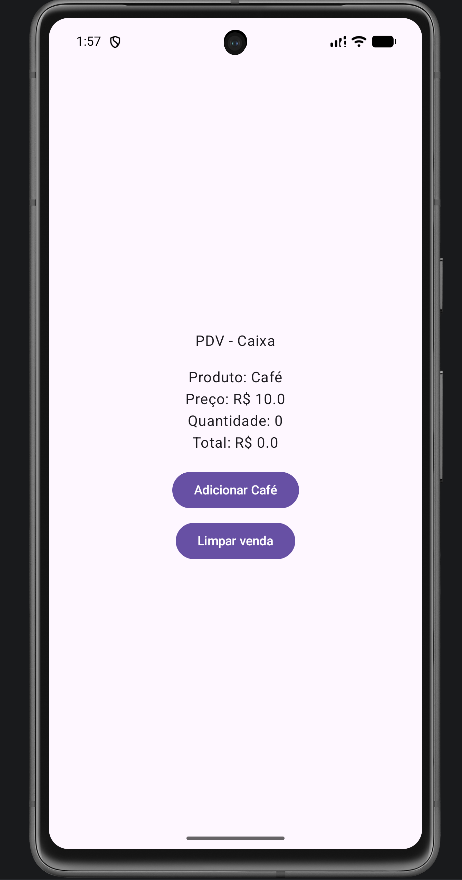
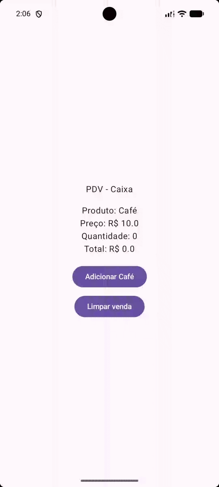

# PDV Android App

App Android desenvolvido em Kotlin para simular um sistema de caixa (PDV).

## 📱 Funcionalidades
- Adicionar produto
- Calcular total
- Limpar venda

## 🛠️ Tecnologias
- Kotlin
- Jetpack Compose
- Android Studio

## 📸 Demonstração

### Tela principal

### Funcionamento

## 🚀 Como rodar
1. Clonar o repositório
2. Abrir no Android Studio
3. Rodar no emulador

## 👨‍💻 Autor
Ricardo
